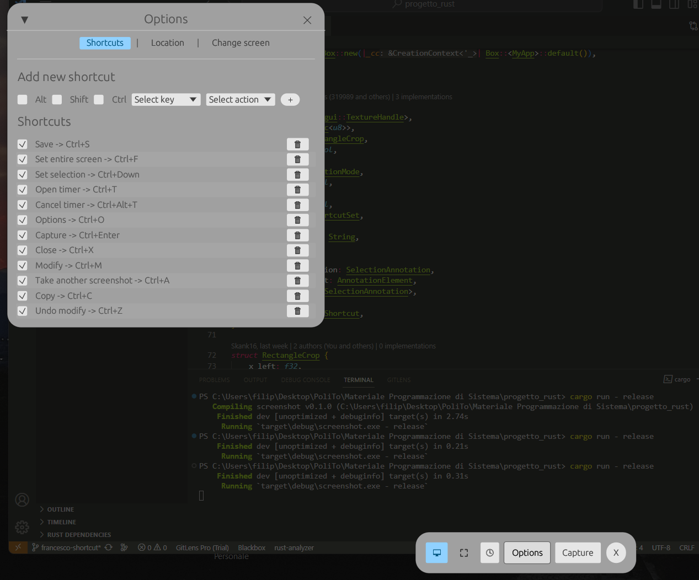
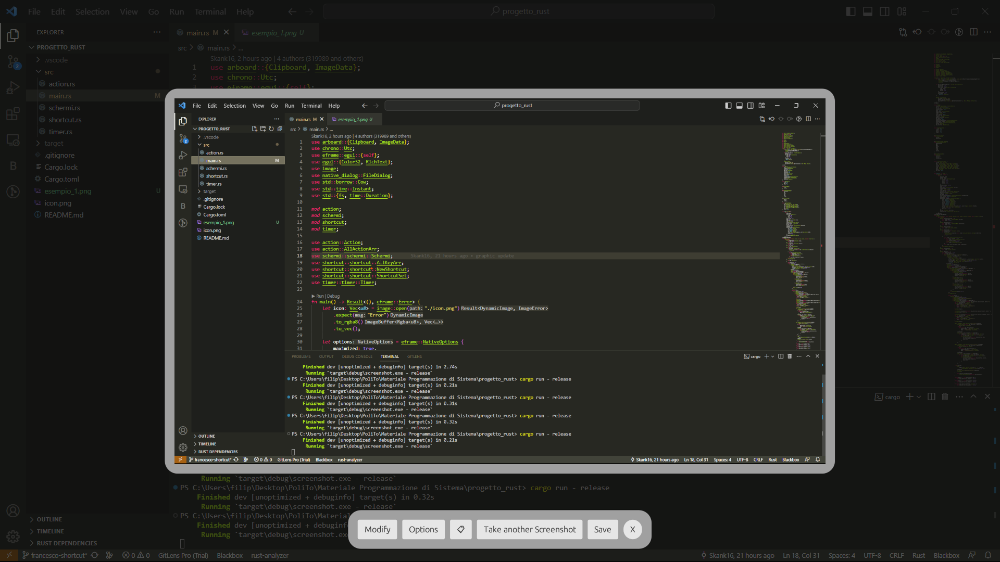

# RUST GRAB UTILITY 🦀
Sviluppato da Filippo Castellarin (308692), Francesco Gallo (319989) e Andrea Scamporrino (318927) per il corso di Programmazione di Sistema del Politecnico di Torino (A.A 2022/2023)
## Crates
- **screenshots**: https://lib.rs/crates/screenshots
- **egui**: https://docs.rs/egui/latest/egui/ (github: https://github.com/emilk/egui.git)
- **native-dialog**: https://docs.rs/native-dialog/latest/native_dialog/
- **arboard**: https://lib.rs/crates/arboard
- **chrono**: https://lib.rs/crates/chrono
- **image**: https://lib.rs/crates/image

## Funzionalità
1. [x] **Platform Support**: l'app può essere utilizzata su tutte le piattaforme.
2. [x] **User Interface (UI)**: interfaccia utente facilmente usufruibile.
3. [x] **Selection Options**: riquadro di selezione della schermata per ritagliare la porzione di schermo da catturare.
4. [x] **Hotkey Support**: possibilità di utilizzare delle shortcut da tastiera per eseguire le operazioni.
5. [x] **Output Format**: diversi formati supportati per il salvataggio della schermata (png, jpg, gif). Salvataggio anche negli appunti del dispositivo.
<!-- FUNZIONALITÀ BONUS -->
6. [x] **Annotation Tools**: tool per disegnare sull'immagine della schermata appena acquisita e salvare le annotazioni.
7. [x] **Delay Timer**: tramite l'interfaccia, l'utente può impostare il delay dopo il quale la schermata sarà catturata.
8. [x] **Save Options**: viene aperta una finestra di dialogo del file system attraverso la quale l'utente può scegliere il nome (se diverso da default) e il formato dell'immagine.
9. [x] **Multi-monitor Support**: possibilità di catturare le schermate anche degli altri schermi connessi.

## Esempio di utilizzo

- `🖵`: per catturare la schermata intera
- `⛶`: per catturare soltanto la porzione di schermo inquadrata
- `🕓`: per impostare un timer
- `Capture`: esegue uno screenshot
- `Options`: per aprire il riquadro dove modificare le opzioni
- `Modify`: apre l'annotation tool per la modifica dell'immagine
    * `🖊`: disegno a tratto libero
    * `/`: disegna un segmento
    * `↖`: disegna una freccia
    * `☐`: disegna un rettangolo
    * `⭕`: disegna un cerchio
    * `Text`: aggiunge un testo sull'immagine (la conferma dell'aggiunta è richiesta da `Save text`)
    * `⟲`: annulla l'ultima modifica
    * `⛶`: ritaglia l'immagine (la conferma del ritaglio è richiesta da ` Save crop`)
    * `Cancel`: annulla tutte le modifiche apportate all'immagine
    * `Save modify`: salva in maniera permanente tutte le modifiche apportate all'immagine

- `📋`: copia l'immagine negli appunti del dispositivo
- `Take another screenshot`: permette di eseguire un altro screenshot cancellando l'immagine e le modifiche in corso 
- `X`: per chiudere l'applicazione

## Percorso di salvataggio predefinito
- `./screenshots`

## Shortcut predefinite
- `ctrl+F` : Imposta la cattura a schermo intero
- `ctrl+ArrowDown` : Imposta la cattura ad una selezione dello schermo
- `ctrl+T` : Visualizza le opzioni di timer
- `ctrl+shift+T` : Inizia il conteggio del timer se è stato configurato, altrimenti apre le opzioni del timer
- `ctrl+alt+T` : Annulla un timer in corso
- `ctrl+O` : Visualizza le opzioni
- `ctrl+enter` : Esegue uno screenshot
- `ctrl+X` : Chiude l'applicazione
- `ctrl+M` : Visualizza le opzioni di modifica dell'immagine una volta acquisita
- `ctrl+A` : Esegue un altro screenshot
- `ctrl+S` : Salva l'immagine
- `Ctrl+C` : Copia l'immagine 
- `Ctrl+Z` : Annulla l'ultima modifica all'immagine
- N.B. i tasti di selezione delle shortcut variano a seconda del sistema operativo in uso: ctrl corrisponde al cmd per macos. 
